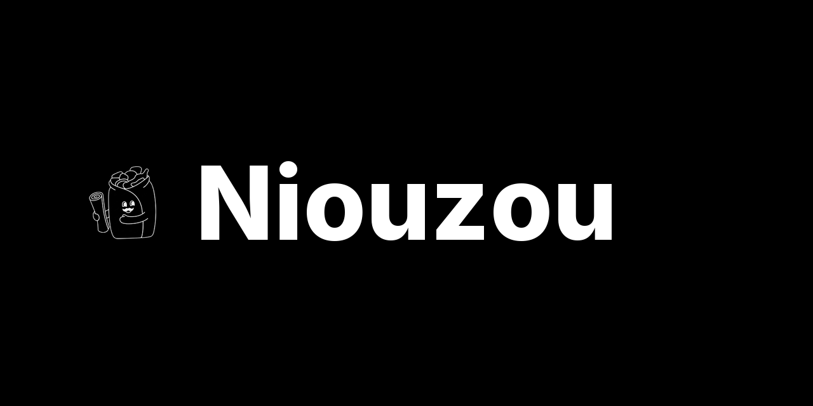

<p align="center">
  
</p>

**A self-hosted news feed that learns what each reader cares about.**

Niouzou is a swipe-based news reader that scores every article 0–100% on how
likely the reader is to care, and learns from each like and dislike. Two scoring
engines run side by side — LLM-extracted keyword weights and semantic k-NN over
local embeddings — and either can drive the feed. No telemetry, no cloud
lock-in, no black box: every weight is inspectable and editable, and the LLM
behind it is swappable for any OpenRouter model.

[](https://github.com/OuApps/niouzou/actions/workflows/ci.yml)


[](https://railway.com/deploy/niouzou?referralCode=bGgJYu)


| | | | |
|---|---|---|---|
|  |  |  |  |

- **Self-hosted** — one-click Railway, or Docker Compose
- **Two scoring engines** — learned keyword weights or semantic k-NN over `pgvector`; either drives the feed
- **Local embeddings** — semantic vectors run on-device (Qwen3-Embedding-0.6B); the LLM that enriches articles is pluggable via any OpenRouter model
- **No black box** — every keyword weight is visible and editable; each article shows why it was promoted
- **Installable PWA** — swipe, save for later, full-text search, no app store

---

## How the scoring works

Two independent relevance scores per article, both computed at ingestion and
persisted side by side (`article_relevance_scores`):

1. **Keyword score** — an LLM (via OpenRouter) extracts weighted keywords from
   each article. Every like and dislike updates the reader's personal keyword
   weights in real time (with decay), and new articles are scored against them
   before they reach the feed.
2. **Smart Match score** — a local embedding model turns each article's
   LLM-written summary into a 1024-dim vector in `pgvector`; the score is a k-NN
   vote over the reader's liked and disliked history, no keywords involved.

Both scores depend on LLM enrichment (via OpenRouter) — keyword extraction for
the first, the article summary the embedding is built from for the second.

`SCORING_MODE` (`keyword` or `smart`) picks which score filters and ranks the
feed; flipping is instant, no re-scoring. `RANDOM_SURFACE_RATE` injects a few
low-score articles so the feed never fully seals the bubble.

Nothing is hidden: the Keywords tab exposes every weight for reading and editing,
and keywords can be pinned to bias either engine. A profile can be reset at any
time from Settings.

<p align="center"></p>

---

## Under the hood

| Layer | What runs |
|---|---|
| **API** | Python 3.13 · FastAPI · SQLAlchemy 2.0 (async) · Pydantic · JWT auth |
| **PWA** | React · TypeScript · Vite · Tailwind — installable, mobile-first |
| **Storage** | PostgreSQL 17 + `pgvector` (1024-dim article embeddings, k-NN) |
| **Ingestion** | Miniflux (RSS/Atom), bootstrapped over its REST API |
| **Embeddings** | Qwen3-Embedding-0.6B via `sentence-transformers`, in the worker, lazy-loaded |
| **LLM** | any OpenRouter model (`OPENROUTER_MODEL`) — summaries + keyword extraction |

---

## Self-hosting

### Local

```bash
git clone https://github.com/OuApps/niouzou.git && cd niouzou
cp .env.example .env
# Edit the secrets and OpenRouter key in .env
docker-compose up -d
```

Open **http://localhost:3000**, register an account, add an RSS feed, and start
swiping. The **first account registered becomes the instance admin**; every
account after is a regular user. Database migrations, the Miniflux admin user,
and Miniflux's API key are all provisioned automatically on the first boot — no
UI step.

---

## Deploy on Railway

Click the button above. It deploys the whole stack in one shot — **5 services**:
`api`, `pwa`, `miniflux`, `refresh-worker` and `Postgres`. Railway generates
`JWT_SECRET` at deploy time; `OPENROUTER_API_KEY` powers the recommendation
features (summaries, keyword + semantic scoring). Niouzou
provisions its own Miniflux access token on first boot — no manual key step.

---

## Configuration

Almost every knob is an environment variable with a sane default.
Some of them can also be changed live from the in-app **admin panel**.

**Override order:** admin panel (stored in the DB) → environment variable →
built-in default. Editing one of them in the admin panel takes effect
immediately.

| Setting | Env var | Default | Admin UI | What it does |
|---|---|---|---|---|
| Auth secret | `JWT_SECRET` | `change-me` | — | Signs auth tokens. **Set a long random string.** |
| Access token TTL | `ACCESS_TOKEN_EXPIRE_MINUTES` | `30` | — | Access-token lifetime (minutes). |
| Refresh token TTL | `REFRESH_TOKEN_EXPIRE_DAYS` | `30` | — | Refresh-token lifetime (days). |
| OpenRouter key | `OPENROUTER_API_KEY` | — | ✅ | **Required for recommendations** — LLM summaries, keyword + semantic scoring. |
| OpenRouter model | `OPENROUTER_MODEL` | `google/gemma-4-26b-a4b-it:free` | ✅ | Any OpenRouter model id. |
| OpenRouter base URL | `OPENROUTER_BASE_URL` | `https://openrouter.ai/api/v1` | — | API endpoint. |
| OpenRouter timeout | `OPENROUTER_TIMEOUT` | `60` | — | Per-request timeout (seconds). |
| Scoring mode | `SCORING_MODE` | `keyword` | ✅ | Active score: `keyword` or `smart`. |
| Score threshold | `SCORE_THRESHOLD` | `0.0` | ✅ | Min active score to surface (0–1). |
| Random surface rate | `RANDOM_SURFACE_RATE` | `0.05` | ✅ | Share of random low-score articles slipped into the feed to break the echo chamber (only bites when the score threshold is > 0). |
| Feed gravity | `FEED_GRAVITY` | `1.5` | — | How fast older articles drop in ranking. |
| Cold-start threshold | `COLD_START_THRESHOLD` | `10` | — | Feedbacks below which the threshold is bypassed. |
| Max keywords / article | `MAX_KEYWORDS_PER_ARTICLE` | `6` | ✅ | Keyword cap stored per article. |
| Smart: neighbourhood | `SMART_TOPK` | `5` | — | k-NN neighbours per polarity. |
| Smart: dislike weight | `SMART_LAMBDA` | `0.8` | — | λ in `raw = S+ − λ·S−`. |
| Smart: sigmoid β | `SMART_BETA` | `2.0` | — | Steepness of the score sigmoid. |
| Smart: decay half-life | `SMART_DECAY_HALFLIFE_DAYS` | `90` | — | Feedback decay half-life (days). |
| Smart: rescore window | `SMART_RESCORE_WINDOW_DAYS` | `14` | — | Nightly rescore window (days). |
| Fetch interval | `CRON_FETCH_INTERVAL` | `15` | ✅ | RSS fetch + enrich cadence (minutes). |
| Enrich interval | `CRON_ENRICH_INTERVAL` | `30` | — | Enrichment pass cadence (minutes). |
| Nightly refresh hour | `CRON_NIGHTLY_REFRESH_HOUR` | `3` | ✅ | UTC hour of weight recompute + dual-score rescore. |
| Fetch batch size | `MINIFLUX_FETCH_BATCH_SIZE` | `100` | — | Entries pulled from Miniflux per run. |
| Enrich batch size | `ENRICH_BATCH_SIZE` | `50` | — | Articles enriched per run. |
| Embedding threads | `EMBEDDING_NUM_THREADS` | auto (≤4) | — | torch thread cap for the embedding model (worker only). |
| OpenMP threads | `OMP_NUM_THREADS` | (unset) | — | OpenMP/BLAS thread cap, read at process start (worker only). Set ~3 to avoid CPU oversubscription. |
| Premium cutoff | `PREMIUM_CONTENT_MAX_CHARS` | `800` | — | Below this length → flagged partial/paywall. |
| Boilerplate (exact) | `ENRICHMENT_BOILERPLATE_EXACT` | — | — | Extra paywall/CGU exact templates (`\|\|\|`-separated). |
| Boilerplate (markers) | `ENRICHMENT_BOILERPLATE_MARKERS` | — | — | Extra boilerplate marker groups. |
| Database DSN | `DATABASE_URL` | built from `POSTGRES_*` | — | Postgres connection (Compose-built). |
| Miniflux URL | `MINIFLUX_URL` | — | — | Miniflux instance URL. |
| App DB user / pass / name | `POSTGRES_USER` · `POSTGRES_PASSWORD` · `POSTGRES_DB` | `niouzou` | — | App database credentials (Compose). |
| Miniflux admin | `MINIFLUX_ADMIN_USERNAME` · `MINIFLUX_ADMIN_PASSWORD` | `admin` · `change-me` | — | RSS admin account, first boot (Compose). |
| Miniflux DB pass | `MINIFLUX_DB_PASSWORD` | `miniflux` | — | `miniflux` DB-user password (Compose). |
| PWA API URL | `VITE_API_URL` | `http://localhost:8000/api/v1` | — | Baked into the bundle at build time. |

**Admin panel only**: edit the LLM prompt bodies, compact/merge the
keyword vocabulary, pick the OpenRouter model from a live priced list, and manage
users (promote admin, reset password).

---

## Licence

Open source under the **GNU AGPL-3.0**. Free to use, modify, and self-host. If
a modified version is run as a network service, its source must be made
available under the same licence (AGPL §13). See [`LICENSE`](LICENSE).

Copyright © 2026 Guillaume Fregosi. Contributions are accepted under the
[Contributor License Agreement](CLA.md), which keeps a future commercial/dual
licence possible.
